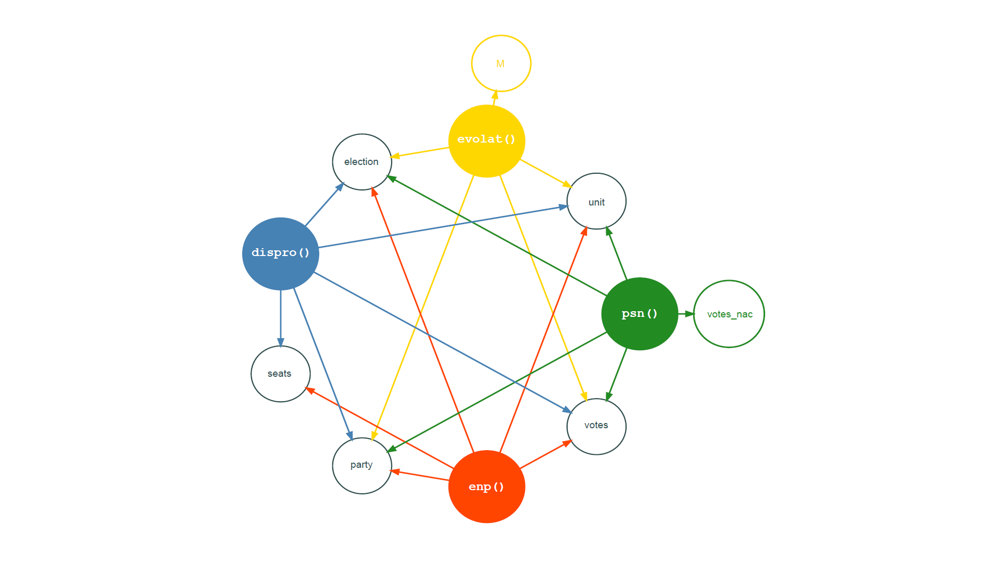

<!-- README.md is generated from README.Rmd. Please edit that file -->
The `esaps` package </a>
------------------------------------------------------------------------------------------------------------------

[](https://travis-ci.org/Nicolas-Schmidt/esaps)
[](https://cran.r-project.org/package=esaps)
[](https://www.r-pkg.org/pkg/esaps)

### Description

It allows structuring electoral data of different size and structure to
calculate various indicators frequently used in the studies of electoral
systems and party systems. Indicators of electoral volatility, electoral
disproportionality, party nationalization and the effective number of
parties are included.

### Installation

You can install the released version (`0.1.0`) of esaps from
[CRAN](https://cran.r-project.org/) with:

``` r
install.packages("esaps")
```

And the development version (`0.2.0`) from
[GitHub](https://cran.r-project.org/) with:

``` r
if (!require("devtools")) install.packages("devtools")
devtools::install_github("Nicolas-Schmidt/esaps")
```

### Functions

<table>
<colgroup>
<col style="width: 28%" />
<col style="width: 30%" />
<col style="width: 15%" />
<col style="width: 26%" />
</colgroup>
<thead>
<tr class="header">
<th>Indicator</th>
<th>Method</th>
<th>Variables</th>
<th>Function</th>
</tr>
</thead>
<tbody>
<tr class="odd">
<td>Electoral Volatility</td>
<td><a href="http://bit.ly/2p4cyZQ">Pedersen (1979)</a></td>
<td><code>election</code> <code>unit</code> <code>party</code> <code>votes</code></td>
<td><code>evolat(..., method=1)</code></td>
</tr>
<tr class="even">
<td></td>
<td><a href="http://bit.ly/2FpoeBm">Powell and Tucker (2014)</a></td>
<td><code>election</code> <code>unit</code> <code>party</code> <code>votes</code></td>
<td><code>evolat(..., method=2)</code></td>
</tr>
<tr class="odd">
<td></td>
<td><a href="http://bit.ly/2FD83zE">Torcal and Lago (2015)</a></td>
<td><code>election</code> <code>unit</code> <code>party</code> <code>votes</code> <code>M</code></td>
<td><code>evolat(..., method=3)</code></td>
</tr>
<tr class="even">
<td>Effective Number of Parties</td>
<td><a href="http://bit.ly/2oYU4dV">Laakso and Taagepera (1979)</a></td>
<td><code>election</code> <code>unit</code> <code>party</code> <code>votes</code> or <code>seats</code></td>
<td><code>enp()</code></td>
</tr>
<tr class="odd">
<td>Party System Nationalization</td>
<td><a href="https://bit.ly/2w9QgtO">Mainwaring and Jones (2003)</a></td>
<td><code>election</code> <code>unit</code> <code>party</code> <code>votes</code> <code>votes_nac</code></td>
<td><code>psn(..., method=1)</code></td>
</tr>
<tr class="even">
<td></td>
<td><a href="https://bit.ly/2oj76SY">Chhibber and Kollman (2004)</a></td>
<td><code>election</code> <code>unit</code> <code>party</code> <code>votes</code> <code>votes_nac</code></td>
<td><code>psn(..., method=2)</code></td>
</tr>
<tr class="odd">
<td>Party Nationalization</td>
<td><a href="https://bit.ly/2w9QgtO">Mainwaring and Jones (2003)</a></td>
<td><code>election</code> <code>unit</code> <code>party</code> <code>votes</code></td>
<td><code>psn(..., method=1, pn=TRUE)</code></td>
</tr>
<tr class="even">
<td>Electoral Disproportionality</td>
<td>Rae (1971)</td>
<td><code>election</code> <code>unit</code> <code>party</code> <code>votes</code> <code>seats</code></td>
<td><code>dispro(..., method=1)</code></td>
</tr>
<tr class="odd">
<td></td>
<td><a href="https://bit.ly/2B1mIDH">Loosemore and Hanby (1971)</a></td>
<td><code>election</code> <code>unit</code> <code>party</code> <code>votes</code> <code>seats</code></td>
<td><code>dispro(..., method=2)</code></td>
</tr>
<tr class="even">
<td></td>
<td>Lijphart_1 (1986)</td>
<td><code>election</code> <code>unit</code> <code>party</code> <code>votes</code> <code>seats</code></td>
<td><code>dispro(..., method=3)</code></td>
</tr>
<tr class="odd">
<td></td>
<td><a href="https://bit.ly/2McLshB">Lijphart_2 (1994)</a></td>
<td><code>election</code> <code>unit</code> <code>party</code> <code>votes</code> <code>seats</code></td>
<td><code>dispro(..., method=4)</code></td>
</tr>
<tr class="even">
<td></td>
<td><a href="https://bit.ly/2M6CPoy">Gallagher (1991)</a></td>
<td><code>election</code> <code>unit</code> <code>party</code> <code>votes</code> <code>seats</code></td>
<td><code>dispro(..., method=5)</code></td>
</tr>
<tr class="odd">
<td></td>
<td><a href="https://bit.ly/2M9Bttr">Cox and Shugart (1991)</a></td>
<td><code>election</code> <code>unit</code> <code>party</code> <code>votes</code> <code>seats</code></td>
<td><code>dispro(..., method=6)</code></td>
</tr>
</tbody>
</table>

### Indicators and Variables

</a>

### Examples

#### Load data

``` r
library(esaps)

votes <- list(data.frame(country = rep("ARG", 3),
                         year = c(1995, 2000, 2005),
                         party_A = c(40,10,20),
                         party_B = c(35,20,40),
                         party_C = c(25,70,40)),
              data.frame(country = rep("URY", 4),
                         year = c(1995, 2000, 2005, 2010),
                         party_A = c(30,30,20,20),
                         party_B = c(30,50,40, 30),
                         party_C = c(30,10,30, 25),
                         party_D = c(10,10,10,25)),
              data.frame(country = rep("BRA", 2),
                         year = c(1993, 1998),
                         party_A = c(30, 55),
                         party_B = c(70, 45)))

votes
#> [[1]]
#>   country year party_A party_B party_C
#> 1     ARG 1995      40      35      25
#> 2     ARG 2000      10      20      70
#> 3     ARG 2005      20      40      40
#> 
#> [[2]]
#>   country year party_A party_B party_C party_D
#> 1     URY 1995      30      30      30      10
#> 2     URY 2000      30      50      10      10
#> 3     URY 2005      20      40      30      10
#> 4     URY 2010      20      30      25      25
#> 
#> [[3]]
#>   country year party_A party_B
#> 1     BRA 1993      30      70
#> 2     BRA 1998      55      45

votes <- convert_esaps(dataset = votes, unit.name = "country", election.name = "year")

votes
#>    election unit   party votes
#> 1      1995  ARG party_A    40
#> 2      2000  ARG party_A    10
#> 3      2005  ARG party_A    20
#> 4      1995  ARG party_B    35
#> 5      2000  ARG party_B    20
#> 6      2005  ARG party_B    40
#> 7      1995  ARG party_C    25
#> 8      2000  ARG party_C    70
#> 9      2005  ARG party_C    40
#> 10     1995  URY party_A    30
#> 11     2000  URY party_A    30
#> 12     2005  URY party_A    20
#> 13     2010  URY party_A    20
#> 14     1995  URY party_B    30
#> 15     2000  URY party_B    50
#> 16     2005  URY party_B    40
#> 17     2010  URY party_B    30
#> 18     1995  URY party_C    30
#> 19     2000  URY party_C    10
#> 20     2005  URY party_C    30
#> 21     2010  URY party_C    25
#> 22     1995  URY party_D    10
#> 23     2000  URY party_D    10
#> 24     2005  URY party_D    10
#> 25     2010  URY party_D    25
#> 26     1993  BRA party_A    30
#> 27     1998  BRA party_A    55
#> 28     1993  BRA party_B    70
#> 29     1998  BRA party_B    45
```

#### Functions

Electoral volatility

``` r
evolat(votes, 1)
#>   election unit eVolat
#> 1     2000  ARG     45
#> 2     2005  ARG     30
#> 3     1998  BRA     25
#> 4     2000  URY     20
#> 5     2005  URY     20
#> 6     2010  URY     15

evolat(tidy_data = votes, method = 1, summary = TRUE)
#> [[1]]
#>   election unit eVolat
#> 1     2000  ARG     45
#> 2     2005  ARG     30
#> 3     1998  BRA     25
#> 4     2000  URY     20
#> 5     2005  URY     20
#> 6     2010  URY     15
#> 
#> [[2]]
#>   unit first_elec last_elec election mean_volat sd_volat
#> 1  ARG       2000      2005        2      37.50    10.61
#> 2  BRA       1998      1998        1      25.00       NA
#> 3  URY       2000      2010        3      18.33     2.89
```

Effective Number of Parties

``` r
enp(votes)
#>   election unit  enp
#> 1     1995  ARG 2.90
#> 2     2000  ARG 1.85
#> 3     2005  ARG 2.78
#> 4     1993  BRA 1.72
#> 5     1998  BRA 1.98
#> 6     1995  URY 3.57
#> 7     2000  URY 2.78
#> 8     2005  URY 3.33
#> 9     2010  URY 3.92
```

Electoral Disproportionality

``` r
votes <- data.frame(election = rep(c(2000, 2005), each = 4),
                   unit  = rep(c("ARG", "URY"), each = 4),
                   party = c("party_A", "party_B","party_C","party_D"),
                   votes = c(20, 30, 40, 10, 30, 35, 25, 10),
                   seats = c(25, 20, 40, 15, 35, 30, 30, 5)
                   )

votes
#>   election unit   party votes seats
#> 1     2000  ARG party_A    20    25
#> 2     2000  ARG party_B    30    20
#> 3     2000  ARG party_C    40    40
#> 4     2000  ARG party_D    10    15
#> 5     2005  URY party_A    30    35
#> 6     2005  URY party_B    35    30
#> 7     2005  URY party_C    25    30
#> 8     2005  URY party_D    10     5

dispro(votes, 1:6, 1)
#>   election unit  Rae  LH Lijphart_1 Lijphart_2 Gallagher Cox_Shugart
#> 1     2000  ARG 0.05 0.1       0.10       0.06      0.32        1.00
#> 2     2005  URY 0.05 0.1       0.05       0.06      0.32        0.73

dispro(tidy_data = votes, method = c("Rae", "Gallagher"))
#>   election unit  Rae Gallagher
#> 1     2000  ARG 0.05      0.32
#> 2     2005  URY 0.05      0.32
```

Party System Nationalization Score and Party Nationalization Score

``` r
votes <- data.frame(election = rep(2000,4),
                    unit  = c("District_1", "District_2","District_1","District_2"),
                    party = c("party_A", "party_A","party_B","party_B"),
                    votes = c(0.60,0.40, 0.30, 0.70),
                    votes_nac = rep(c(0.55,0.45),2)
                    )

votes
#>   election       unit   party votes votes_nac
#> 1     2000 District_1 party_A   0.6      0.55
#> 2     2000 District_2 party_A   0.4      0.45
#> 3     2000 District_1 party_B   0.3      0.55
#> 4     2000 District_2 party_B   0.7      0.45

psns(tidy_data = votes, method = 1)
#>   election  psns
#> 1     2000 84.85

psns(tidy_data = votes, method = 1, pns = TRUE)
#> $PSNS
#>   election  psns
#> 1     2000 84.85
#> 
#> $PNS
#>     party election   pns
#> 1 party_A     2000 0.853
#> 2 party_B     2000 0.844
```

### Citation

To cite `esaps` in publications, please use:

``` r
citation("esaps")
```

### Author

Nicolas Schmidt (<nschmidt@cienciassociales.edu.uy>)
